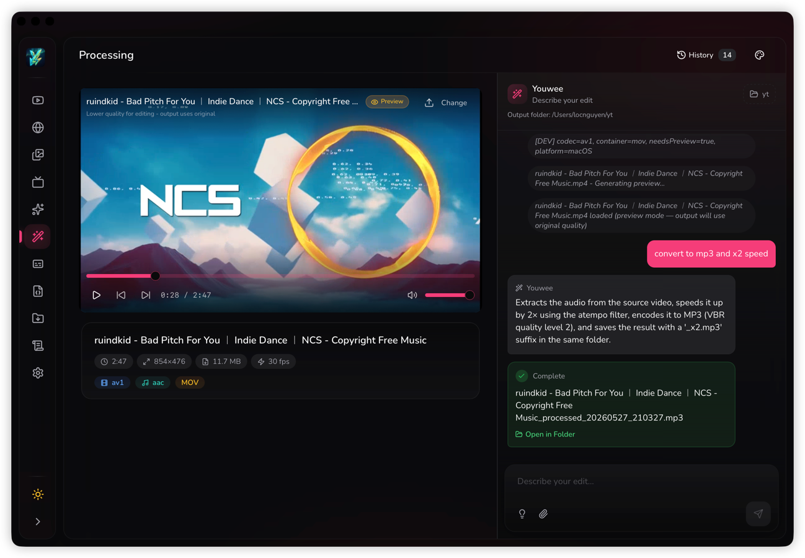
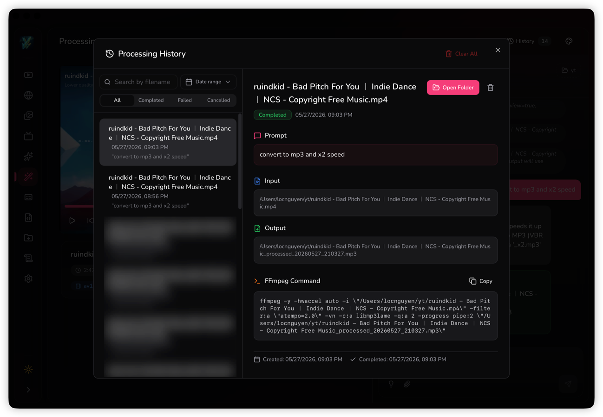
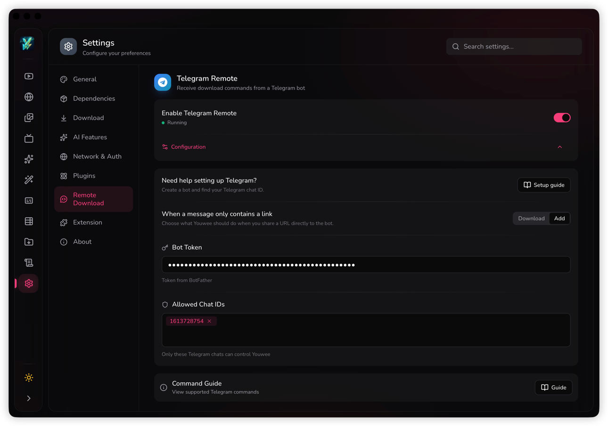

# Youwee

<div align="center">

  [](README.md)
  [](docs/README.vi.md)
  [](docs/README.zh-CN.md)
  
  
  
  
  [](https://github.com/vanloctech/youwee/discussions/18)

  
  
  **A modern, beautiful YouTube video downloader built with Tauri and React**

  [](https://github.com/vanloctech/youwee/releases)
  [](https://opensource.org/licenses/MIT)
  [](https://www.reddit.com/r/youwee)
  [](https://tauri.app/)
  [](https://react.dev/)

<a href="https://www.producthunt.com/products/youwee/reviews/new?utm_source=badge-product_review&utm_medium=badge&utm_source=badge-youwee" target="_blank"></a>
</div>

---

## Features

- **Video Downloads** — YouTube, TikTok, Facebook, Instagram, Bilibili, Youku, and 1800+ sites
- **Browser Extension Bridge** — Chromium + Firefox extension with floating button, media/quality picker, and one-click `Download now` / `Add to queue` send to Youwee app
- **Plugins & Workflow Automation** — Install signed plugins, configure custom fields, assign them to download workflows, and extend Youwee with notifications, uploads, and post-download automations
- **Channel Follow** — Follow YouTube, Bilibili & Youku channels, get notified of new videos, auto-download, and manage from system tray
- **Metadata Fetcher** — Download video info, descriptions, comments, and thumbnails without the video
- **Live Stream Support** — Download live streams with dedicated toggle
- **AI Video Summary** — Summarize videos with Gemini, OpenAI, or Ollama
- **AI Video Processing** — Edit videos using natural language (cut, convert, resize, extract audio)
- **Time Range Download (Cut Video)** — Download only the segment you need by setting start/end time
- **Batch & Playlist** — Download multiple videos or entire playlists
- **Audio Extraction** — Extract audio in MP3, M4A, or Opus formats
- **Subtitle Support** — Download or embed subtitles
- **Subtitle Workshop** — Create, edit, and refine subtitles (SRT/VTT/ASS) with timing tools, find/replace, auto-fix, AI Translate, AI Grammar Fix, and Whisper generation
- **Subtitle Page Core Features** — Waveform/spectrogram timeline, shot-change sync, realtime QC with style profiles, split/merge tools, translator mode (source/target), and batch/project operations
- **Post-Processing** — Auto-embed metadata, thumbnail, and subtitles (when enabled) into output files
- **SponsorBlock** — Automatically skip sponsors, intros, outros, and self-promotions with remove/mark/custom modes
- **Speed Limit** — Control download bandwidth (KB/s, MB/s, GB/s)
- **Download Library** — Track and manage all your downloads
- **6 Beautiful Themes** — Midnight, Aurora, Sunset, Ocean, Forest, Candy
- **Fast & Lightweight** — Built with Tauri for minimal resource usage

## Screenshots


<details>
<summary><strong>More Screenshots</strong></summary>









</details>

## Demo Video

▶️ [Watch on YouTube](https://www.youtube.com/watch?v=H7TtVZWxilU)


## Installation

### Download for your platform

> ⚠️ **Note**: The app is not signed with an Apple Developer certificate yet. If macOS blocks the app, open terminal and run:
> ```bash
> xattr -cr /Applications/Youwee.app
> ```

| Platform | Download                                                                                                                                                                                                                                   |
|----------|--------------------------------------------------------------------------------------------------------------------------------------------------------------------------------------------------------------------------------------------|
| **Windows** (x64) | [Download .msi](https://github.com/vanloctech/youwee/releases/latest/download/Youwee-Windows.msi) · [Download .exe](https://github.com/vanloctech/youwee/releases/latest/download/Youwee-Windows-Setup.exe)                                |
| **macOS** (Apple Silicon) | [Download .dmg](https://github.com/vanloctech/youwee/releases/latest/download/Youwee-Mac-Apple-Silicon.dmg)                                                                                                                                |
| **macOS** (Intel) | [Download .dmg](https://github.com/vanloctech/youwee/releases/latest/download/Youwee-Mac-Intel.dmg)                                                                                                                                        |
| **Linux** (x64) | [Download .deb](https://github.com/vanloctech/youwee/releases/latest/download/Youwee-Linux.deb) · [Download .AppImage](https://github.com/vanloctech/youwee/releases/latest/download/Youwee-Linux.AppImage) (Recommend for auto update) |

> See all releases on the [Releases page](https://github.com/vanloctech/youwee/releases)

### Browser Extension (Chromium + Firefox)

| Browser | Download |
|---------|----------|
| **Chromium** (Chrome/Edge/Brave/Opera/Vivaldi/Arc/Coc Coc) | [Download .zip](https://github.com/vanloctech/youwee/releases/latest/download/Youwee-Extension-Chromium.zip) |
| **Firefox** | [Download .xpi](https://github.com/vanloctech/youwee/releases/latest/download/Youwee-Extension-Firefox-signed.xpi) |

- One-click send current page to Youwee with `Download now` or `Add to queue`
- Floating button supports `Video/Audio` + quality selection on supported sites
- Popup works on any valid HTTP/HTTPS tab
- Guide: [docs/browser-extension.md](docs/browser-extension.md)

### Plugins

Extend Youwee with signed `.ywp` plugins for post-download workflows such as notifications, uploads, and third-party integrations.

- Recommended plugins and install guide: [PLUGINS.md](PLUGINS.md)
- SDK: [sdk-js/README.md](sdk-js/README.md) · [youwee-sdk](https://www.npmjs.com/package/youwee-sdk)

### Build from Source

#### Prerequisites

- [Bun](https://bun.sh/) (v1.3.5 or later)
- [Rust](https://www.rust-lang.org/) (v1.70 or later)
- [Tauri CLI](https://tauri.app/v1/guides/getting-started/prerequisites)

#### Steps

```bash
# Clone the repository
git clone https://github.com/vanloctech/youwee.git
cd youwee

# Install dependencies
bun install

# Run in development mode
bun run tauri dev

# Build for production
bun run tauri build
```

## Contributing

We welcome contributions. See [Contributing Guide](CONTRIBUTING.md).

## License

This project is licensed under the MIT License - see the [LICENSE](LICENSE) file for details.

## Contact

- **GitHub**: [@vanloctech](https://github.com/vanloctech)
- **Issues**: [GitHub Issues](https://github.com/vanloctech/youwee/issues)

---

## Star History

<picture>
  <source
    media="(prefers-color-scheme: dark)"
    srcset="
      https://api.star-history.com/svg?repos=vanloctech/youwee&type=Date&theme=dark
    "
  />
  <source
    media="(prefers-color-scheme: light)"
    srcset="
      https://api.star-history.com/svg?repos=vanloctech/youwee&type=Date
    "
  />
  
</picture>
