# Youwee

<div align="center">

  [](../README.md)
  [](README.vi.md)
  [](README.zh-CN.md)
  [](https://github.com/vanloctech/youwee/discussions/18)

  
  
  **Ứng dụng tải video YouTube hiện đại, đẹp mắt được xây dựng với Tauri và React**

  [](https://github.com/vanloctech/youwee/releases)
  [](https://opensource.org/licenses/MIT)
  [](https://www.reddit.com/r/youwee)
  [](https://tauri.app/)
  [](https://react.dev/)
</div>

---

## Tính năng

- **Tải Video** — YouTube, TikTok, Facebook, Instagram, và hơn 1800 trang web khác
- **Theo dõi Kênh** — Theo dõi kênh YouTube, Bilibili & Youku, nhận thông báo video mới, tự động tải xuống, và quản lý từ system tray
- **Tóm tắt Video bằng AI** — Tóm tắt video với Gemini, OpenAI, hoặc Ollama
- **Xử lý Video bằng AI** — Chỉnh sửa video bằng ngôn ngữ tự nhiên (cắt, chuyển đổi, thay đổi kích thước, trích xuất âm thanh)
- **Tải theo khoảng thời gian (Cắt video)** — Chỉ tải đoạn cần thiết bằng cách đặt thời gian bắt đầu/kết thúc
- **Tải hàng loạt & Playlist** — Tải nhiều video hoặc toàn bộ playlist
- **Trích xuất Âm thanh** — Trích xuất âm thanh định dạng MP3, M4A, hoặc Opus
- **Hỗ trợ Phụ đề** — Tải hoặc nhúng phụ đề
- **Hậu xử lý** — Tự động nhúng metadata, thumbnail và phụ đề (khi bật) vào file đầu ra
- **SponsorBlock** — Tự động bỏ qua sponsor, intro, outro và đoạn tự quảng bá với các chế độ xóa/đánh dấu/tùy chỉnh
- **Thư viện Tải xuống** — Theo dõi và quản lý tất cả các bản tải
- **6 Giao diện Đẹp** — Midnight, Aurora, Sunset, Ocean, Forest, Candy
- **Nhanh & Nhẹ** — Xây dựng với Tauri cho hiệu suất tối ưu

## Ảnh chụp màn hình

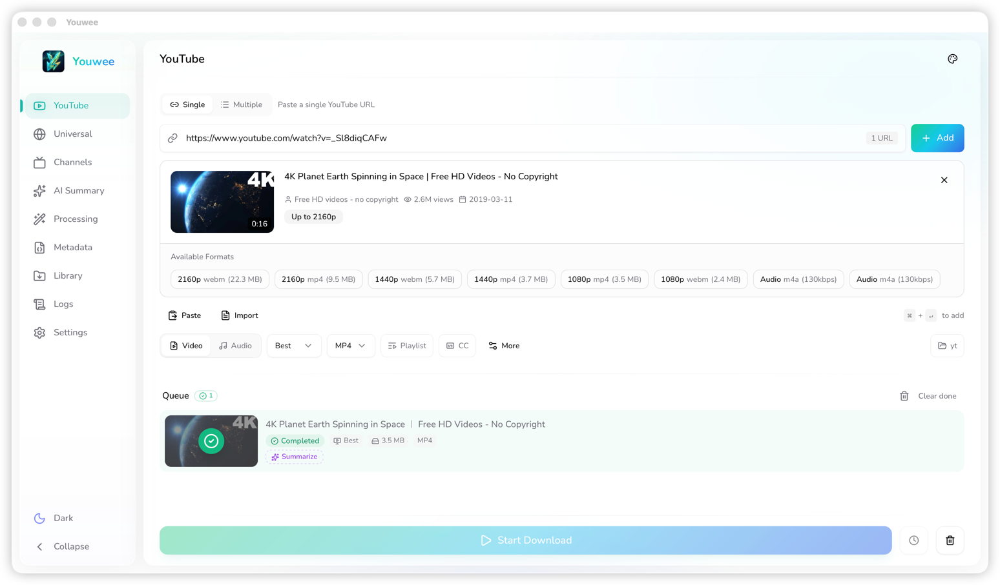

<details>
<summary><strong>Xem thêm ảnh</strong></summary>

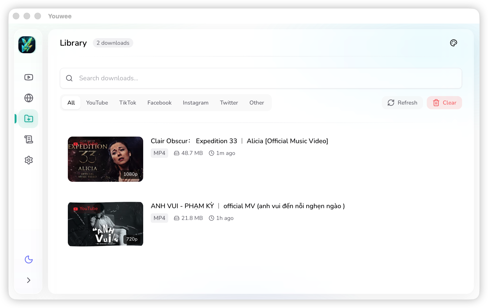
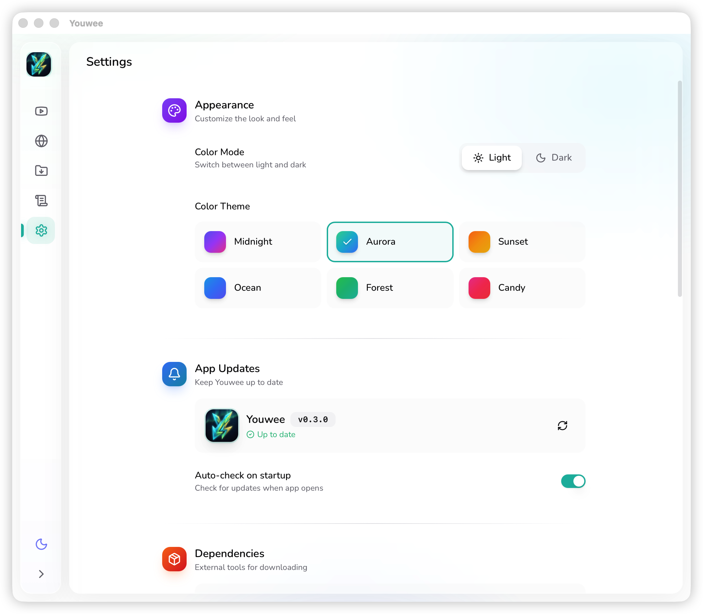
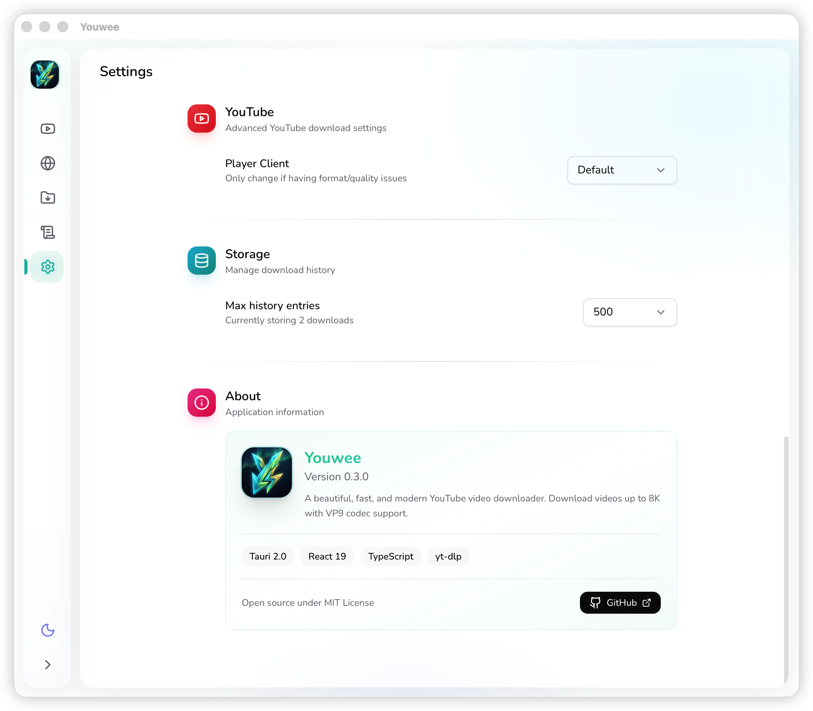
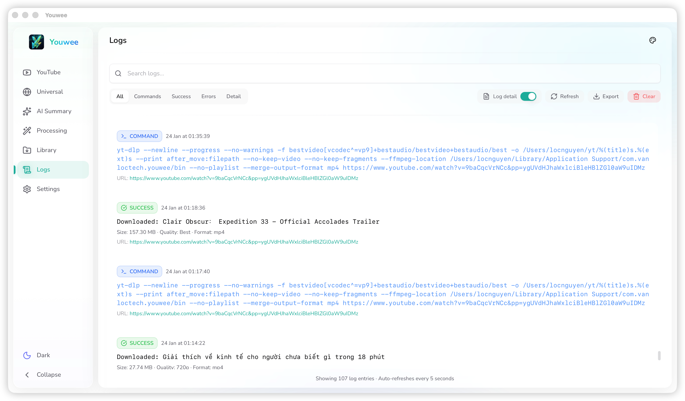
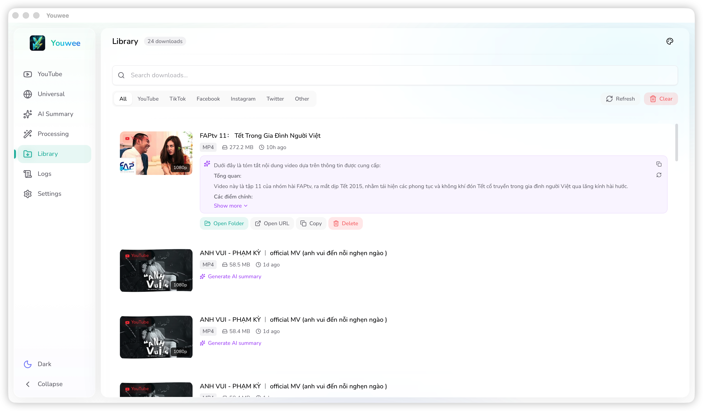
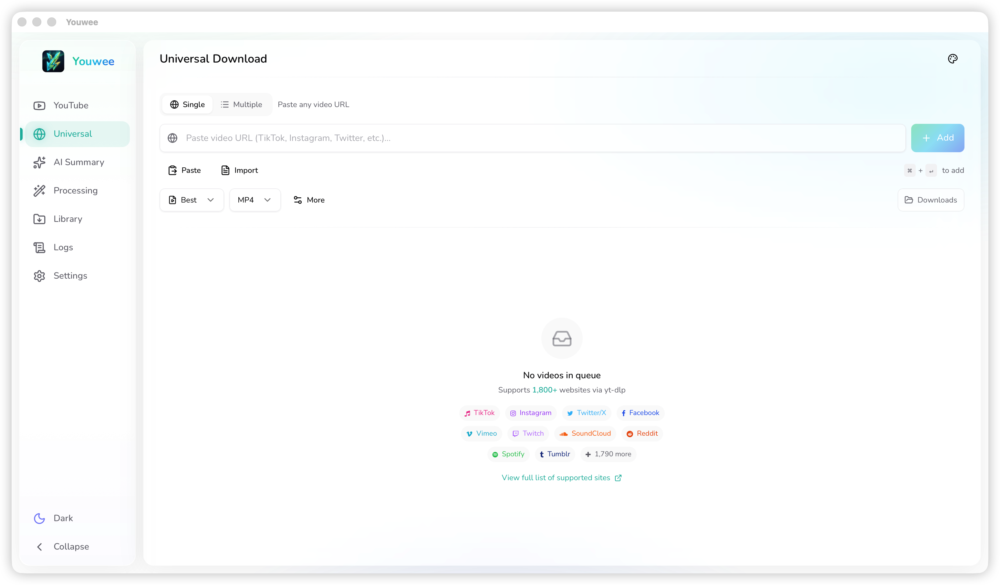

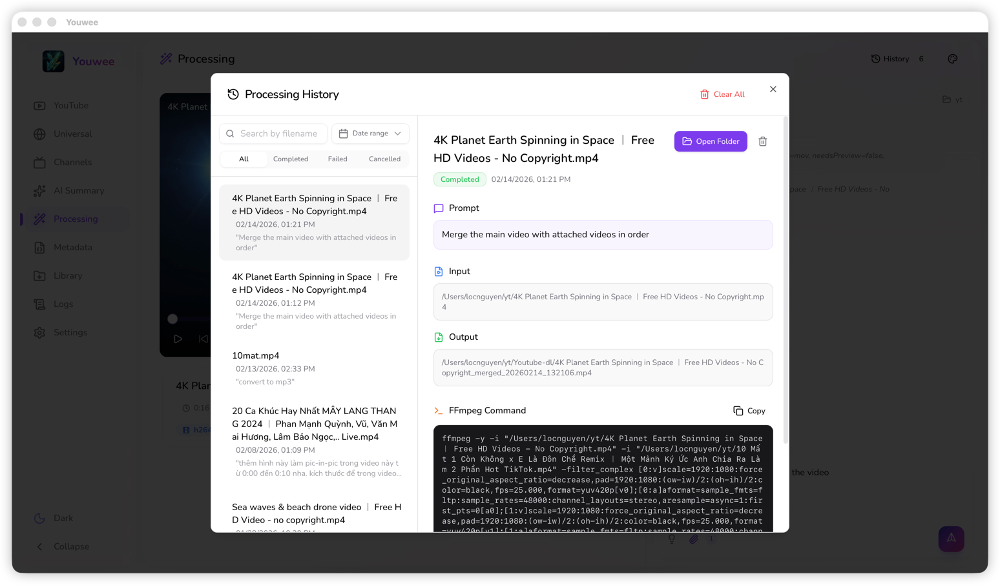
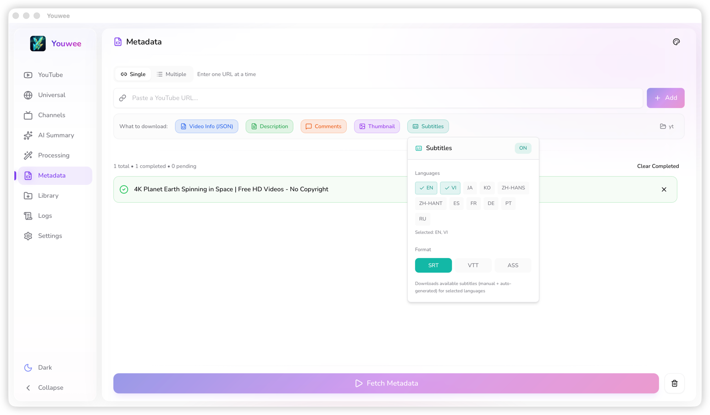
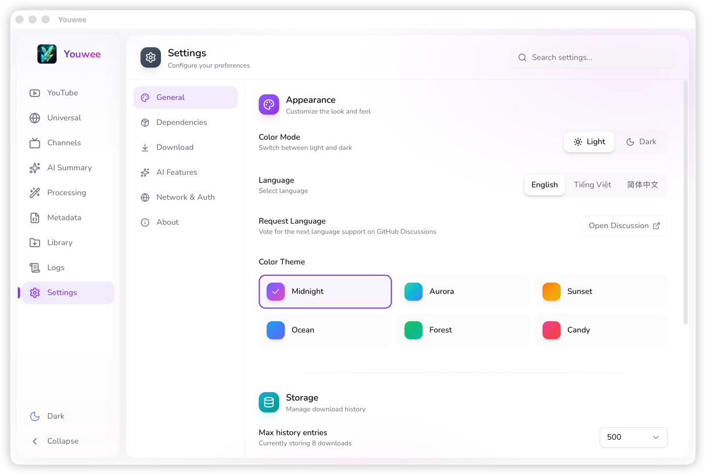
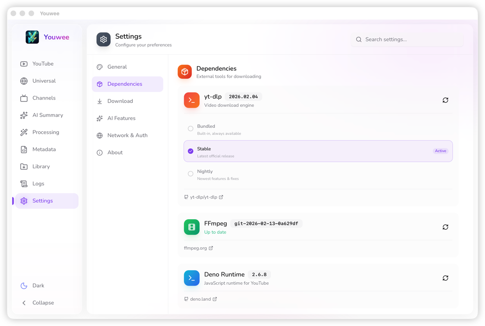

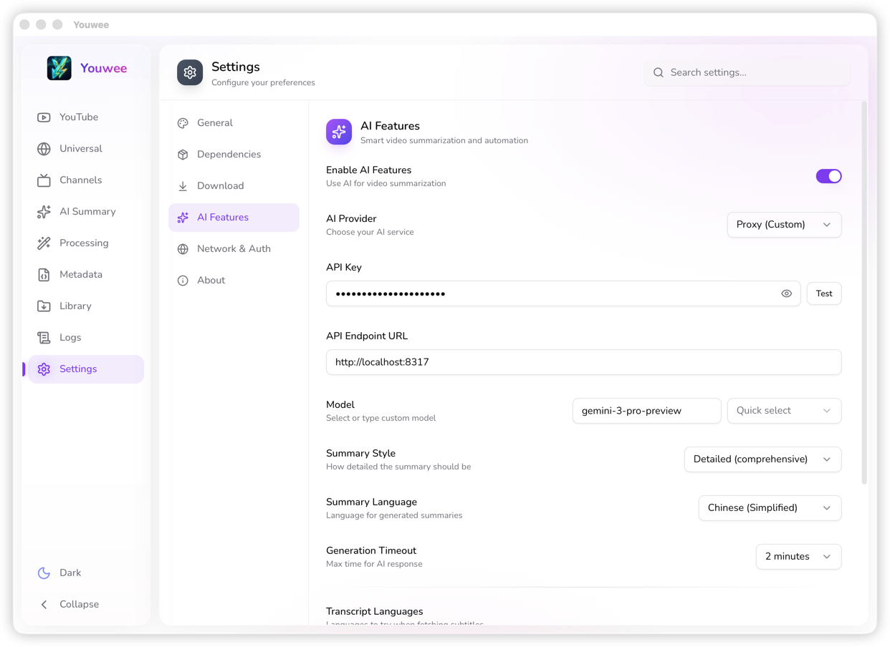


</details>

## Video Demo

▶️ [Xem trên YouTube](https://www.youtube.com/watch?v=H7TtVZWxilU)


## Cài đặt

### Tải về cho nền tảng của bạn

| Nền tảng | Tải về |
|----------|--------|
| **Windows** (x64) | [Tải .msi](https://github.com/vanloctech/youwee/releases/latest/download/Youwee-Windows.msi) · [Tải .exe](https://github.com/vanloctech/youwee/releases/latest/download/Youwee-Windows-Setup.exe) |
| **macOS** (Apple Silicon) | [Tải .dmg](https://github.com/vanloctech/youwee/releases/latest/download/Youwee-Mac-Apple-Silicon.dmg) |
| **macOS** (Intel) | [Tải .dmg](https://github.com/vanloctech/youwee/releases/latest/download/Youwee-Mac-Intel.dmg) |
| **Linux** (x64) | [Tải .deb](https://github.com/vanloctech/youwee/releases/latest/download/Youwee-Linux.deb) · [Tải .AppImage](https://github.com/vanloctech/youwee/releases/latest/download/Youwee-Linux.AppImage) |

> Xem tất cả các phiên bản tại [trang Releases](https://github.com/vanloctech/youwee/releases)

> ⚠️ **Lưu ý**: Ứng dụng chưa được ký bằng chứng chỉ Apple Developer. Nếu macOS chặn ứng dụng, hãy chạy:
> ```bash
> xattr -cr /Applications/Youwee.app
> ```

### Xây dựng từ mã nguồn

#### Yêu cầu

- [Bun](https://bun.sh/) (v1.3.5 hoặc mới hơn)
- [Rust](https://www.rust-lang.org/) (v1.70 hoặc mới hơn)
- [Tauri CLI](https://tauri.app/v1/guides/getting-started/prerequisites)

#### Các bước

```bash
# Clone repository
git clone https://github.com/vanloctech/youwee.git
cd youwee

# Cài đặt dependencies
bun install

# Chạy ở chế độ development
bun run tauri dev

# Build cho production
bun run tauri build
```

## Công nghệ sử dụng

- **Frontend**: React 19, TypeScript, Tailwind CSS, shadcn/ui
- **Backend**: Rust, Tauri 2.0
- **Downloader**: yt-dlp (tích hợp sẵn)
- **Build**: Bun, Vite

## Đóng góp

Chúng tôi hoan nghênh mọi đóng góp! Xem [Hướng dẫn Đóng góp](CONTRIBUTING.vi.md) để biết chi tiết về:

- Bắt đầu phát triển
- Quy ước commit
- Hướng dẫn pull request

## Giấy phép

Dự án này được cấp phép theo MIT License - xem file [LICENSE](../LICENSE) để biết chi tiết.

## Lời cảm ơn

- [yt-dlp](https://github.com/yt-dlp/yt-dlp) - Trình tải video mạnh mẽ
- [FFmpeg](https://ffmpeg.org/) - Framework đa phương tiện cho xử lý audio/video
- [Bun](https://bun.sh/) - JavaScript runtime nhanh cho trích xuất YouTube
- [Tauri](https://tauri.app/) - Xây dựng ứng dụng desktop nhỏ hơn, nhanh hơn và bảo mật hơn
- [shadcn/ui](https://ui.shadcn.com/) - Các component UI đẹp mắt
- [Lucide Icons](https://lucide.dev/) - Bộ icon mã nguồn mở đẹp

## Liên hệ

- **GitHub**: [@vanloctech](https://github.com/vanloctech)
- **Issues**: [GitHub Issues](https://github.com/vanloctech/youwee/issues)

---

## Star History

<picture>
  <source
    media="(prefers-color-scheme: dark)"
    srcset="
      https://api.star-history.com/svg?repos=vanloctech/youwee&type=Date&theme=dark
    "
  />
  <source
    media="(prefers-color-scheme: light)"
    srcset="
      https://api.star-history.com/svg?repos=vanloctech/youwee&type=Date
    "
  />
  
</picture>

<div align="center">
  Made with ❤️ by Việt Nam
</div>
